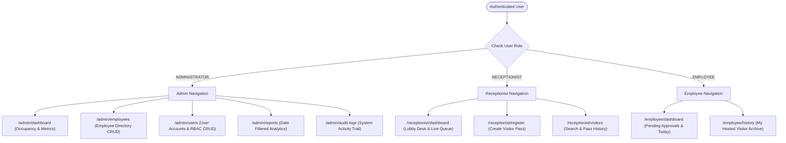
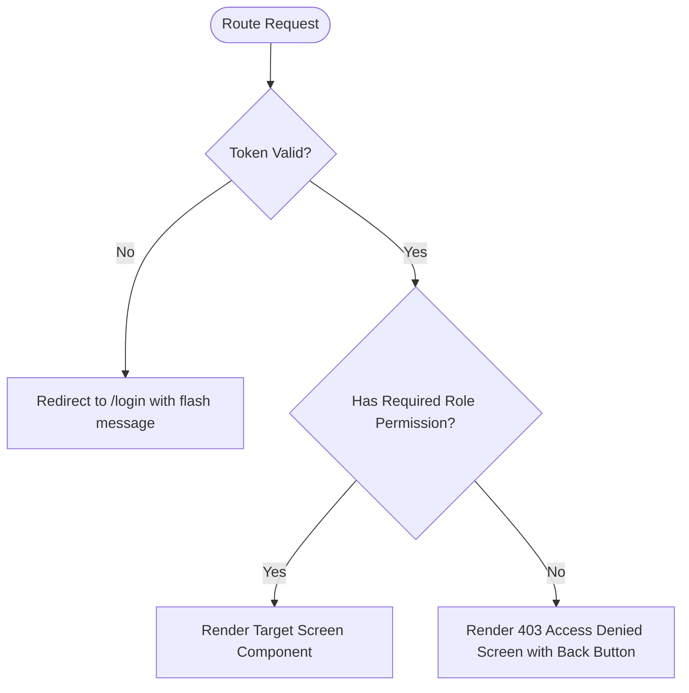

# Jayam VPMS — Navigation & Information Architecture

## Document Control
- **Document Version:** 1.0.0
- **Status:** Approved Navigation Specification
- **Design System:** Aegis UI
- **Source Specification:** `06-page-map.md`, `11-auth-security.md`

---

## 1. Global Shell Navigation Architecture

The application layout utilizes a persistent **Two-Tier Navigation Shell**:
1. **Top Application Bar:** Displays brand identity, active workplace status, role badge, authenticated user display name, and account logout trigger.
2. **Left-Hand Navigation Sidebar:** Dynamic, role-governed menu rendering only the destination links permitted for the active session.

```
┌─────────────────────────────────────────────────────────────────────────────┐
│ [🛡️ JAYAM VPMS]   [🏢 Main Headquarters]   [Role: RECEPTIONIST] [👤 Sarah J ▾]│
├──────────────────┬──────────────────────────────────────────────────────────┤
│ SIDEBAR MENU     │ MAIN WORKSPACE VIEW                                      │
│                  │                                                          │
│ 📊 Dashboard     │                                                          │
│ ➕ Register Pass │                                                          │
│ 📋 Visitor Queue │                                                          │
│ 🔍 History       │                                                          │
│                  │                                                          │
│ ⚙️ Sign Out      │                                                          │
└──────────────────┴──────────────────────────────────────────────────────────┘
```

---

## 2. Role-Based Navigation Routing Matrix



---

## 3. Sidebar Navigation Specifications by Role

### 3.1 Administrator Navigation (`ADMINISTRATOR`)
- **Brand Header:** `Jayam VPMS — Enterprise Admin`
- **Menu Items:**
  1. **Overview Dashboard** (`/admin/dashboard`): Icon: `LayoutDashboard`, Label: "Dashboard".
  2. **Employee Directory** (`/admin/employees`): Icon: `UserCheck`, Label: "Manage Employees".
  3. **User Accounts** (`/admin/users`): Icon: `ShieldAlert`, Label: "User Management".
  4. **Reports & Analytics** (`/admin/reports`): Icon: `BarChart3`, Label: "Visitor Reports".
  5. **Activity Audit Logs** (`/admin/audit-logs`): Icon: `FileText`, Label: "Activity History".
- **Bottom Utility:** Sign Out (`/login`), Icon: `LogOut`.

### 3.2 Receptionist Navigation (`RECEPTIONIST`)
- **Brand Header:** `Jayam VPMS — Front Desk`
- **Menu Items:**
  1. **Reception Desk** (`/receptionist/dashboard`): Icon: `Users`, Label: "Lobby Operations".
  2. **Register Visitor** (`/receptionist/register`): Icon: `UserPlus`, Label: "Register Visitor", Badge: `+ New` (Emerald).
  3. **Visitor Records** (`/receptionist/visitors`): Icon: `Search`, Label: "Visitor History".
- **Bottom Utility:** Sign Out (`/login`), Icon: `LogOut`.

### 3.3 Employee Navigation (`EMPLOYEE`)
- **Brand Header:** `Jayam VPMS — Host Portal`
- **Menu Items:**
  1. **My Requests** (`/employee/dashboard`): Icon: `Inbox`, Label: "Approvals & Today", Badge: Dynamic count of pending requests (e.g. `2` in Amber).
  2. **Visit History** (`/employee/history`): Icon: `Clock`, Label: "My Hosted Visitors".
- **Bottom Utility:** Sign Out (`/login`), Icon: `LogOut`.

---

## 4. Top Application Bar Anatomy

```
┌─────────────────────────────────────────────────────────────────────────────┐
│ [☰] [🛡️ JAYAM VPMS]   |   [RECEPTIONIST Badge]   |   [👤 Sarah Jenkins] [⎋]│
└─────────────────────────────────────────────────────────────────────────────┘
```

1. **Mobile Menu Hamburger (`[☰]`):** Visible only on screens $< 1024\text{px}$ (`lg:hidden`). Toggles the slide-over navigation drawer.
2. **Brand Title & Logo:** Sleek shield icon with bold white/slate typography.
3. **Role Pill Badge:**
   - Admin: `bg-purple-100 text-purple-800 border-purple-200`
   - Receptionist: `bg-blue-100 text-blue-800 border-blue-200`
   - Employee: `bg-emerald-100 text-emerald-800 border-emerald-200`
4. **User Profile Capsule:** Displays logged-in user's full name, email, and department/role avatar.
5. **Quick Logout Trigger (`[⎋]`):** Clears JWT, resets auth context, and transitions to `/login` with an informational toast.

---

## 5. Breadcrumb & Contextual Header System

On nested or sub-workflow pages, a standardized breadcrumb header is rendered above the content canvas:

```
Home / Front Desk / Register New Visitor
┌─────────────────────────────────────────────────────────────────────────────┐
│ Register New Visitor Pass                     [ ✕ Cancel & Return to Lobby ]│
│ Create a physical visitor pass and dispatch for employee host verification  │
└─────────────────────────────────────────────────────────────────────────────┘
```

- **Breadcrumb Path:** `text-xs text-slate-400 font-medium`, interactive links.
- **Main Heading:** `text-2xl font-bold text-slate-900`.
- **Subtext / Helper:** `text-sm text-slate-500 mt-1`.
- **Header Actions:** Right-aligned primary or secondary action buttons (e.g. `+ Register Visitor`, `Export Report CSV`, `Print Pass`).

---

## 6. Route Guards & Access Denied Redirection



- **Unauthenticated Users:** Redirected to `/login`.
- **Unauthorized Role Access (e.g. Employee visiting `/admin/users`):** Intercepted by `<ProtectedRoute roles={['ADMINISTRATOR']}>` and renders a clean 403 screen with a "Return to Dashboard" primary button.
- **404 Not Found:** Renders a clean 404 screen with an option to return to the active role's dashboard.
