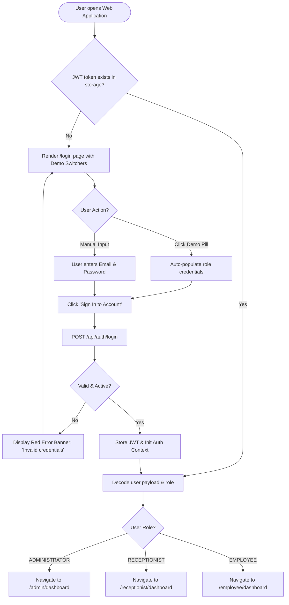

# User Flow 01: Authentication, Role Routing & Session Lifecycle

## Document Control
- **Flow ID:** `UF-01`
- **Design System:** Aegis UI
- **Source Requirement:** `FR-AUTH-01`, `FR-AUTH-02`, `05-user-flows.md`

---

## 1. Visual User Journey Diagram

---

## 2. Screen & UI State Transitions

1. **Unauthenticated Access:** Navigating directly to any internal URL (`/receptionist/register`, `/admin/users`) without a valid token immediately triggers a redirect to `/login` with an informational toast.
2. **Role Clearance Gate:** Attempting to navigate across roles (e.g. Employee visiting `/admin/dashboard`) renders the 403 Forbidden screen.
3. **Session Expiry (401 Interception):** When an API call returns `401 Unauthorized`, Axios interceptor purges `localStorage` and routes to `/login` with alert: `"Your session has expired. Please sign in again."`
