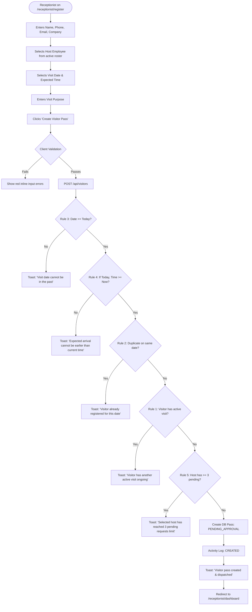

# User Flow 02: Visitor Registration & Business Rules Enforcement

## Document Control
- **Flow ID:** `UF-02`
- **User Role:** `RECEPTIONIST`
- **Design System:** Aegis UI
- **Source Requirement:** `FR-VIS-01`, Rules 1, 2, 3, 4, 5

---

## 1. Visual User Journey Diagram

---

## 2. Decision Points & Error Recovery

- **Rule 5 Breach Recovery:** If the selected host has 3 pending requests, the form highlights the host field and suggests alternative staff or requests the employee clear their queue.
- **Rule 2/1 Duplicate Breach Recovery:** If an active pass exists, the system provides a link to view the existing pass in `/receptionist/visitors`.
