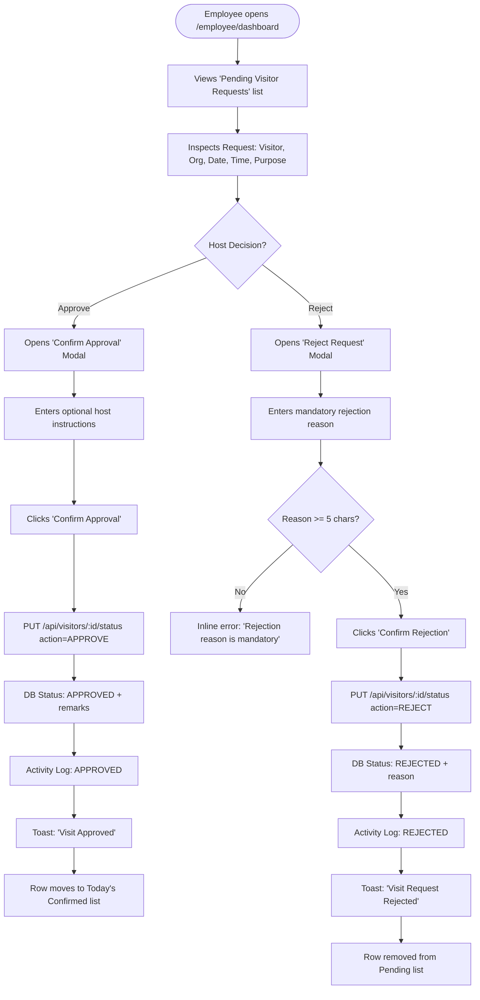

# User Flow 03: Host Employee Request Review & Approvals

## Document Control
- **Flow ID:** `UF-03`
- **User Role:** `EMPLOYEE`
- **Design System:** Aegis UI
- **Source Requirement:** `FR-VIS-02`, `05-user-flows.md`

---

## 1. Visual User Journey Diagram

---

## 2. Capacity & Real-Time Queue Updates
- Both Approval and Rejection immediately decrement the host employee's pending count, freeing up capacity for new visitor passes under Rule 5.
