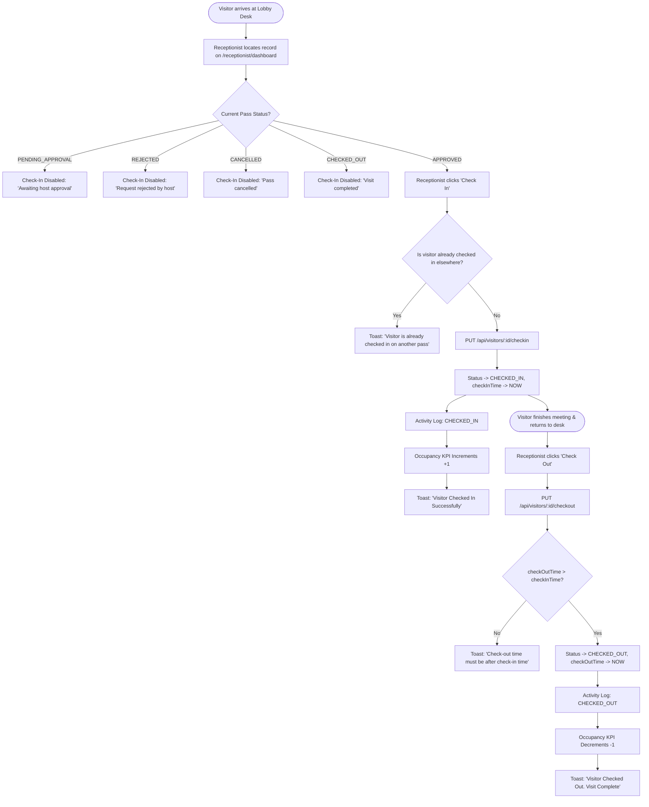

# User Flow 04: Front-Desk Check-In & Check-Out Operations

## Document Control
- **Flow ID:** `UF-04`
- **User Role:** `RECEPTIONIST`
- **Design System:** Aegis UI
- **Source Requirement:** `FR-VIS-03`, `FR-VIS-04`, Rules 6, 7, 8, 9

---

## 1. Visual User Journey Diagram

---

## 2. Real-Time Occupancy Impact
- Every successful Check-In immediately increments the live workplace occupancy count.
- Every successful Check-Out immediately decrements the live occupancy count and archives the pass into historical records.
