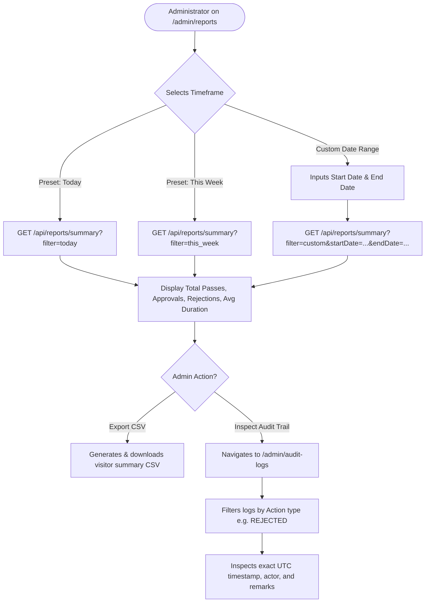

# User Flow 05: Reports Generation & Forensic Audit Trail Inspection

## Document Control
- **Flow ID:** `UF-05`
- **User Role:** `ADMINISTRATOR`
- **Design System:** Aegis UI
- **Source Requirement:** `FR-REP-02`, `FR-AUD-01`, `05-user-flows.md`

---

## 1. Visual User Journey Diagram

---

## 2. Compliance & Audit Verification
- Provides executive compliance officers with a tamper-evident chain of custody for any visitor on any historical date.
