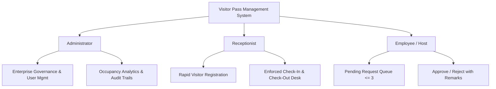

# 01. Product Overview — Visitor Pass Management System (VPMS)

## Document Control
- **Document Version:** 1.0.0
- **Status:** Approved for Discovery / Pre-Development
- **Author:** Senior Product & Solution Architecture Team
- **Source Specification:** `React Interview Task V5.0.md`

---

## 1. Product Name
**Visitor Pass Management System (VPMS)**  
*(Working Title: Jayam VPMS / Workplace Visitor Management Platform)*

---

## 2. One-Line Description
A secure, role-based MERN web application to streamline physical visitor registration, host employee approval workflows, front-desk check-in/check-out operations, and historical audit reporting.

---

## 3. Product Description
The Visitor Pass Management System (VPMS) is a centralized, digital visitor reception and security management solution designed for corporate offices, facilities, and enterprises. It replaces manual paper logbooks with an automated, auditable, and role-governed digital lifecycle.

The system enforces strict organizational security rules:
- Front-desk receptionists register arriving or scheduled visitors.
- Host employees are immediately tasked with approving or rejecting visitor requests with contextual remarks.
- Receptionists manage physical arrival (check-in) and departure (check-out) only after verified host authorization.
- Administrators oversee corporate user accounts, manage employee directories, inspect real-time workplace occupancy, analyze visitor trends via date-filtered reports, and review immutable activity logs.

---

## 4. Problem Statement
Physical office spaces face critical security, operational, and compliance bottlenecks when managing visitor entries:
1. **Manual Logbook Vulnerabilities:** Paper visitor logs are easily falsified, illegible, lack timestamps, pose data privacy risks (visitors viewing previous entries), and cannot enforce host pre-approvals.
2. **Unverified Facility Access:** Without structured host confirmation, uninvited or unscheduled guests can wander into secure office zones.
3. **No Real-Time Occupancy Visibility:** Security and administration lack instantaneous visibility into how many external visitors are currently inside the premises during emergencies or standard operations.
4. **Lack of Auditability & Accountable Logging:** Traditional methods cannot reliably answer *who* approved a visitor, *when* check-in/out occurred, or *why* an entry was rejected.
5. **Host Bottlenecks & Overcrowding:** Unregulated visitor influx can overwhelm individual employees who have too many simultaneous pending requests awaiting review.

---

## 5. Current Situation vs. Proposed Solution

| Dimension | Current Situation (Manual / Legacy) | Proposed Solution (VPMS) |
| :--- | :--- | :--- |
| **Registration** | Paper logbook at front desk or ad-hoc phone calls | Digital form with duplicate prevention, date/time validations, and employee assignment |
| **Authorization** | Verbal confirmation or unverified entry | Direct digital request dispatched to host employee; check-in blocked until approved |
| **Enforcement** | Subjective, prone to human error | 10 hard-coded business rules enforced at database and API layers |
| **Workplace Safety** | Unknown real-time visitor count inside building | Live dashboard KPI showing "Visitors Currently Inside" |
| **Audit Trail** | None or fragmented paper slips | Complete chronological activity log (Created, Approved, Rejected, Checked In, Checked Out, Cancelled) with timestamps and user attribution |
| **Reporting** | Tedious manual counting over days/weeks | Real-time filtered reports (Today, This Week, Custom Date Range) with exportable metrics |

---

## 6. Product Vision
To establish an intuitive, zero-friction, and tamper-evident physical visitor management standard that enhances facility security, empowers front-desk operational velocity, and provides corporate compliance teams with transparent visitor analytics.

---

## 7. Product Goals
1. **Enforce 100% Host Authorization:** Guarantee that zero visitors are checked in without explicit digital approval from an internal employee.
2. **Eliminate Scheduling Conflicts & Duplicates:** Automatically reject duplicate registrations for the same visitor on the same date and prevent multiple concurrent active visits.
3. **Provide Real-Time Premises Visibility:** Deliver instantaneous dashboards for Receptionists, Employees, and Administrators reflecting real-time visitor statuses.
4. **Ensure Complete Accountability:** Record every state transition (Created $\to$ Approved/Rejected $\to$ Checked In $\to$ Checked Out / Cancelled) in an immutable activity log.
5. **Fast Delivery & Reliability:** Implement a lightweight, responsive, and robust full-stack solution utilizing MongoDB, Express.js, React.js, and Node.js within the 2-calendar-day deployment timeline.

---

## 8. Non-Goals (Out of Scope for MVP)
To guarantee high code quality and adhere to the strict 2-day delivery constraint, the following items are intentionally excluded from the initial release:
- ❌ **Self-Service Kiosk / QR Code Scanner:** Visitor scanning via physical hardware kiosks or badge barcode readers.
- ❌ **SMS / WhatsApp / Push Notification Webhooks:** External automated notification gateways (host notification is handled via in-app dashboard queues).
- ❌ **Facial Recognition / Photo Capture:** Webcam snapshot capture during front-desk registration *(Can be a Phase 2 enhancement)*.
- ❌ **Multi-Tenant SaaS / Multi-Branch Facilities:** The system will model a single enterprise organization/facility.
- ❌ **Automated ID Badge Thermal Printing:** Direct ESC/POS hardware integration for badge printing.
- ❌ **SSO / Active Directory Sync:** SAML/OAuth2 enterprise single sign-on (authentication will use secure JWT with email/password and seeded roles).

---

## 9. Target Users & Core Value Proposition

- **Administrator:** Full governance over users, employee directory, enterprise-wide occupancy metrics, aggregated reports, and compliance audit logs.
- **Receptionist:** Streamlined front-desk workflow to quickly register visitors, monitor approval statuses, check in authorized guests, and check them out upon exit.
- **Employee (Host):** Clean, uncluttered approval interface to review visiting requests, add remarks, approve legitimate visitors, or reject unauthorized visits.

---

## 10. Known Constraints & Delivery Parameters
- **Technology Stack Constraint:** Must use MERN Stack (MongoDB, Express.js, React.js, Node.js).
- **Time Constraint:** Must be ready for review and deployment within **2 calendar days**.
- **Deployment Targets:** Frontend on Vercel / Netlify; Backend on Render / Railway / Vercel Serverless; Database on MongoDB Atlas.
- **Business Rule Constraints:** 10 mandatory business rules specified in the task prompt must be strictly enforced.

---

## 11. Confirmed Requirements vs. Assumptions vs. Open Questions

### A. Confirmed Requirements (From Source Material)
- [x] Secure JWT-based Authentication with Role-Based Access Control (RBAC) for Admin, Receptionist, Employee.
- [x] Dedicated dashboards for each role reflecting contextual KPIs (e.g. Visitors Inside, Pending Requests, Today's Visitors).
- [x] Visitor Registration by Receptionist containing Visitor Details, Employee to Visit, Schedule (Date & Time), and Purpose.
- [x] Approval workflow: Employee reviews $\to$ Approves / Rejects with remarks.
- [x] Check-In and Check-Out actions handled by Receptionist post-approval.
- [x] 10 explicit business rules (concurrency limits, date validations, max 3 pending requests per host, etc.).
- [x] Multi-criteria search and filtering (Visitor Name, Employee Name, Visit Date, Status).
- [x] Reports engine supporting Today, This Week, and Custom Date Range filters.
- [x] Immutable activity history capturing Action, Timestamp, User, and Request reference.

### B. Reasonable Assumptions (Inferred for Completeness)
- `Assumption-01`: Visitor identification is anchored on a unique identifier such as `Email` or `Phone Number` + `Full Name` to accurately enforce Rule 1 (no multiple active visits) and Rule 2 (no duplicate visits on same date).
- `Assumption-02`: Cancellation of a visit can be triggered by a Receptionist or Host before check-in occurs (Rule 10).
- `Assumption-03`: System will include an initial database seeding script (`npm run seed`) with default credentials for Admin, Receptionist, and Employee to enable instant testing upon deployment.
- `Assumption-04`: Passcodes/Tokens or Pass IDs (e.g. `VP-20260824-001`) are generated upon registration to enable quick lookup at the front desk.

### C. Open Questions / Items Needing Clarification
- `Needs Clarification-01`: Can an Administrator also act as a Receptionist or Employee (i.e. hierarchical role inheritance or strict role separation)? *(Default assumption: strict role separation with admin having read/management override).*
- `Needs Clarification-02`: Does an Employee record exist as a separate entity from a User Account, or is an Employee simply a User Account with `role = 'EMPLOYEE'`? *(Default assumption: Employee entity is linked 1:1 with a User Account).*
