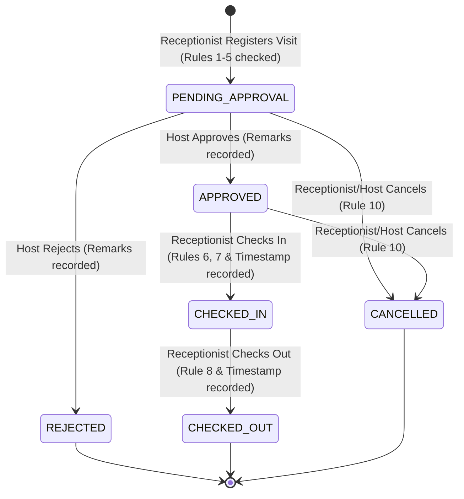
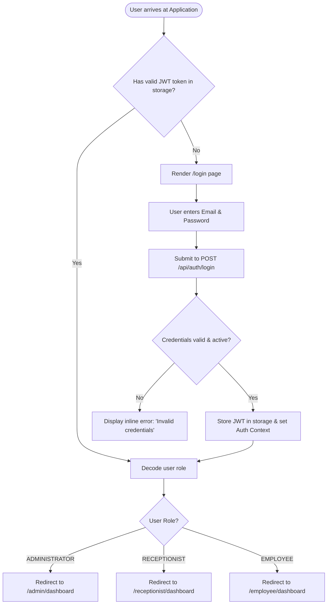
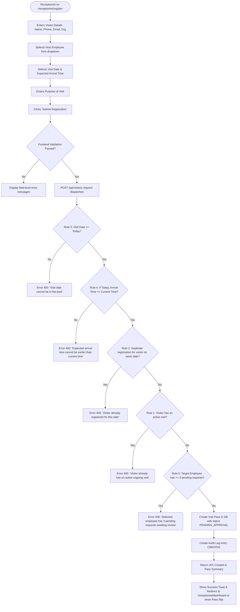
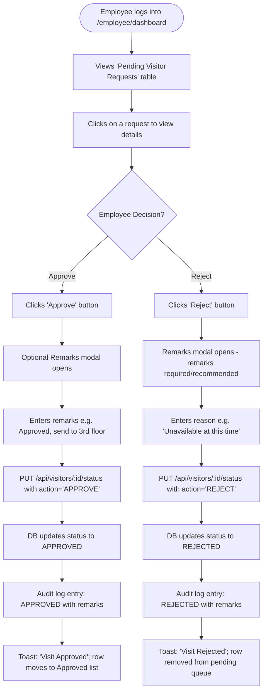
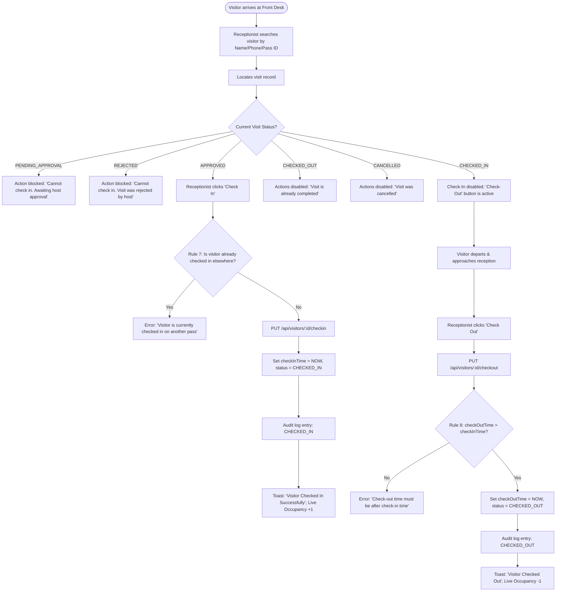
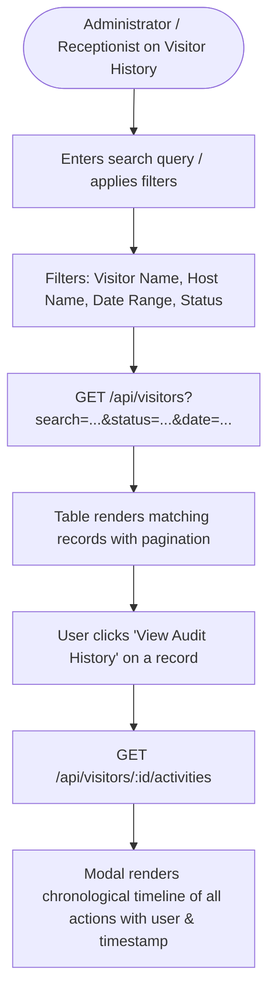

# 05. User Flows & State Machines — VPMS

## Document Control
- **Document Version:** 1.0.0
- **Status:** Approved for Discovery / Pre-Development
- **Source Specification:** `React Interview Task V5.0.md`

---

## 1. Overall Visitor Pass State Machine

---

## 2. Core User Flows

### Flow 1: Authentication & Role-Based Routing

- **Goal:** Securely authenticate user and route them directly to their role-specific workspace.
- **Starting Point:** `/login` or application root `/`.
- **Decision Points:** Valid credentials? Active account status? Role identifier.
- **Success State:** User land on their designated dashboard with token persisted.
- **Failure State:** Toast/alert showing invalid credentials; login form resets password field.
- **Edge Cases:** Token expired mid-session (interceptor captures 401, clears storage, redirects to `/login` with flash message "Session expired").

---

### Flow 2: Visitor Registration Flow (Receptionist)

- **Goal:** Register a legitimate visitor without violating scheduling, concurrency, or host capacity rules.
- **Starting Point:** Receptionist clicks "Register Visitor" (`/receptionist/register`).
- **Decision Points:** Date $\ge$ Today; Time $\ge$ Now (if today); Duplicate on same date; Active visit exists; Host pending count $< 3$.
- **Success State:** Pass generated with `PENDING_APPROVAL` status; activity log created; receptionist sees success feedback.
- **Failure State:** Specific error toast returned for any breached business rule; form state preserved for easy correction.
- **Edge Cases:** Host employee is marked inactive while form was open (backend validates employee is active).

---

### Flow 3: Employee Review & Approval Flow

- **Goal:** Employee reviews pending requests and either approves or rejects with contextual remarks.
- **Starting Point:** `/employee/dashboard`.
- **Decision Points:** Approve or Reject; remarks entered.
- **Success State:** Request status updated; host's pending count decrements; activity log recorded.
- **Failure State:** Network failure or request already modified by admin/receptionist (error toast displayed, table refreshed).
- **Edge Cases:** Employee attempts to approve an already cancelled or rejected visit (backend blocks transition).

---

### Flow 4: Front-Desk Check-In & Check-Out Operations

- **Goal:** Accurately control physical access and record precise check-in and check-out timestamps.
- **Starting Point:** Receptionist Dashboard or Visitor List.
- **Decision Points:** Status must be `APPROVED` for check-in; Status must be `CHECKED_IN` for check-out; Timestamps logically consistent.
- **Success State:** Timestamps recorded; occupancy counter correctly increments/decrements.
- **Failure State:** Action denied with explicit business rule explanation.

---

### Flow 5: Search, Reports & Audit Log Inspection

- **Goal:** Filter historical data and inspect complete audit trails.
- **Starting Point:** Visitor History or Reports page.
- **Decision Points:** Filter parameters selected.
- **Success State:** Dynamic list updates instantly; audit modal shows complete chronological timeline.
