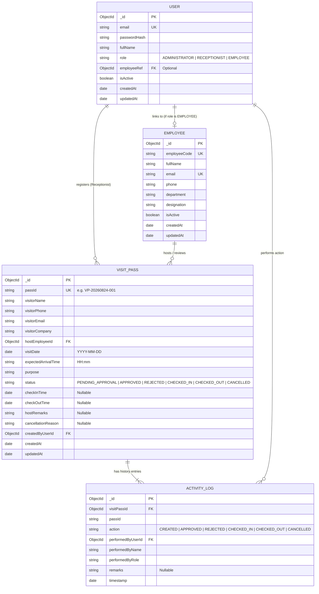

# 09. Data Model & Schema Specification — VPMS

## Document Control
- **Document Version:** 1.0.0
- **Status:** Approved for Discovery / Pre-Development
- **Database Engine:** MongoDB (with Mongoose ODM)
- **Source Specification:** `React Interview Task V5.0.md`

---

## 1. Entity-Relationship (ER) Diagram

---

## 2. Collection Schemas & Field Definitions

### 2.1 Collection: `users`
Represents authentication credentials, system roles, and account state.

| Field Name | Type | Required | Unique | Constraints / Description |
| :--- | :--- | :---: | :---: | :--- |
| `_id` | `ObjectId` | Auto | Yes | Primary Key |
| `email` | `String` | Yes | Yes | Trimmed, lowercase, valid email format |
| `password` | `String` | Yes | No | Bcrypt hashed string (salt rounds $\ge 10$) |
| `fullName` | `String` | Yes | No | Full display name of user |
| `role` | `String` | Yes | No | Enum: `['ADMINISTRATOR', 'RECEPTIONIST', 'EMPLOYEE']` |
| `employeeRef` | `ObjectId` | No | No | References `employees._id` (if role is `EMPLOYEE`) |
| `isActive` | `Boolean` | Yes | No | Default: `true`. Controls account suspension |
| `createdAt` | `Date` | Auto | No | Mongoose `timestamps: true` |
| `updatedAt` | `Date` | Auto | No | Mongoose `timestamps: true` |

**Indexes:**
- `{ email: 1 }` (Unique)
- `{ role: 1 }`
- `{ employeeRef: 1 }`

---

### 2.2 Collection: `employees`
Represents the organization's staff directory available to host visitors.

| Field Name | Type | Required | Unique | Constraints / Description |
| :--- | :--- | :---: | :---: | :--- |
| `_id` | `ObjectId` | Auto | Yes | Primary Key |
| `employeeCode`| `String` | Yes | Yes | e.g. `EMP-1001`, uppercase |
| `fullName` | `String` | Yes | No | Staff member's name |
| `email` | `String` | Yes | Yes | Corporate email address |
| `phone` | `String` | Yes | No | Contact phone number |
| `department` | `String` | Yes | No | e.g. "Engineering", "HR", "Operations" |
| `designation` | `String` | Yes | No | e.g. "Lead Architect", "HR Specialist" |
| `isActive` | `Boolean` | Yes | No | Default: `true`. Inactive staff cannot be selected |
| `createdAt` | `Date` | Auto | No | Mongoose `timestamps: true` |
| `updatedAt` | `Date` | Auto | No | Mongoose `timestamps: true` |

**Indexes:**
- `{ employeeCode: 1 }` (Unique)
- `{ email: 1 }` (Unique)
- `{ department: 1 }`
- `{ isActive: 1 }`

---

### 2.3 Collection: `visit_passes`
Represents the core visitor request and physical pass lifecycle.

| Field Name | Type | Required | Unique | Constraints / Description |
| :--- | :--- | :---: | :---: | :--- |
| `_id` | `ObjectId` | Auto | Yes | Primary Key |
| `passId` | `String` | Yes | Yes | Formatted Pass Identifier (e.g. `VP-20260824-001`) |
| `visitorName` | `String` | Yes | No | Visitor's full legal name |
| `visitorPhone`| `String` | Yes | No | Visitor's mobile contact number |
| `visitorEmail`| `String` | No | No | Optional email for confirmation |
| `visitorCompany`| `String`| Yes | No | Company or organization visitor represents |
| `hostEmployeeId`| `ObjectId`| Yes | No | References `employees._id` |
| `visitDate` | `Date` | Yes | No | Normalized to start of day (`YYYY-MM-DD`) |
| `expectedArrivalTime`| `String`| Yes| No | Format: `HH:mm` (24-hour e.g. "14:30") |
| `purpose` | `String` | Yes | No | Reason for visit (min 5 chars) |
| `status` | `String` | Yes | No | Enum: `['PENDING_APPROVAL', 'APPROVED', 'REJECTED', 'CHECKED_IN', 'CHECKED_OUT', 'CANCELLED']` (Default: `PENDING_APPROVAL`) |
| `checkInTime` | `Date` | No | No | Recorded upon physical admission |
| `checkOutTime`| `Date` | No | No | Recorded upon physical exit (`checkOutTime > checkInTime`) |
| `hostRemarks` | `String` | No | No | Notes added by host upon approve/reject |
| `cancellationReason`| `String`| No| No | Recorded if visit is cancelled before check-in |
| `createdByUserId`| `ObjectId`| Yes| No | References `users._id` (Receptionist) |
| `createdAt` | `Date` | Auto | No | Mongoose `timestamps: true` |
| `updatedAt` | `Date` | Auto | No | Mongoose `timestamps: true` |

**Compound & Query Indexes:**
- `{ passId: 1 }` (Unique)
- `{ visitorPhone: 1, visitDate: 1 }` (Compound index supporting Rule 2 duplicate check)
- `{ visitorPhone: 1, status: 1 }` (Compound index supporting Rule 1 active visit check)
- `{ hostEmployeeId: 1, status: 1 }` (Compound index supporting Rule 5 pending count check)
- `{ visitDate: 1, status: 1 }` (Dashboard & Report queries)
- `{ visitorName: 'text', visitorPhone: 'text' }` (Fast text search)

---

### 2.4 Collection: `activity_logs`
Immutable audit log tracking all status transitions and administrative interventions.

| Field Name | Type | Required | Constraints / Description |
| :--- | :--- | :---: | :--- |
| `_id` | `ObjectId` | Auto | Primary Key |
| `visitPassId` | `ObjectId` | Yes | References `visit_passes._id` |
| `passId` | `String` | Yes | Redundant string copy for fast log queries |
| `action` | `String` | Yes | Enum: `['CREATED', 'APPROVED', 'REJECTED', 'CHECKED_IN', 'CHECKED_OUT', 'CANCELLED']` |
| `performedByUserId` | `ObjectId` | Yes | References `users._id` |
| `performedByName` | `String` | Yes | Snapshot of user's display name |
| `performedByRole` | `String` | Yes | Snapshot of role (`ADMINISTRATOR`, `RECEPTIONIST`, `EMPLOYEE`) |
| `remarks` | `String` | No | Optional or mandatory contextual comments |
| `timestamp` | `Date` | Yes | UTC Date/Time (Default: `Date.now`) |

**Indexes:**
- `{ visitPassId: 1, timestamp: -1 }` (Ordered audit history per pass)
- `{ action: 1, timestamp: -1 }` (System-wide audit filtering)
- `{ timestamp: -1 }` (Recent activity feeds)

---

## 3. Database Constraints Mapping to Business Rules

1. **Rule 1 (Max 1 Active Visit):**
   - Active statuses defined as: `['PENDING_APPROVAL', 'APPROVED', 'CHECKED_IN']`.
   - Query before insert/update:
     `db.visit_passes.findOne({ visitorPhone, status: { $in: ['PENDING_APPROVAL', 'APPROVED', 'CHECKED_IN'] } })`
2. **Rule 2 (No Duplicate on Same Date):**
   - Query before insert:
     `db.visit_passes.findOne({ visitorPhone, visitDate: normalizedDate, status: { $ne: 'CANCELLED' } })`
3. **Rule 5 (Max 3 Pending Requests per Host):**
   - Query before insert:
     `db.visit_passes.countDocuments({ hostEmployeeId, status: 'PENDING_APPROVAL' }) < 3`
4. **Rule 8 (Check-Out > Check-In):**
   - Mongoose validation pre-save hook on check-out:
     `if (this.checkOutTime && this.checkInTime && this.checkOutTime <= this.checkInTime) throw new Error(...)`
