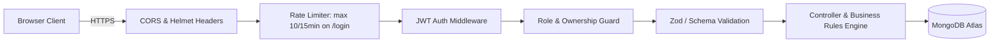

# 11. Authentication, Authorization & Security Architecture — VPMS

## Document Control
- **Document Version:** 1.0.0
- **Status:** Approved for Discovery / Pre-Development
- **Source Specification:** `React Interview Task V5.0.md`

---

## 1. Authentication Architecture

### 1.1 Token-Based Authentication (JWT)
The system employs stateless JSON Web Tokens (JWT) for user authentication:
- **Algorithm:** HMAC using SHA-256 (`HS256`).
- **Token Payload:**
```json
{
  "userId": "66c8fb1234567890abcdef01",
  "email": "sarah.reception@jayam.com",
  "fullName": "Sarah Jenkins",
  "role": "RECEPTIONIST",
  "employeeRef": null,
  "iat": 1756040000,
  "exp": 1756068800
}
```
- **Token Lifespan:** 8 hours (standard shift duration).
- **Client Storage:** Persisted in `localStorage` or `sessionStorage` with Axios interceptors automatically injecting `Authorization: Bearer <token>` into outbound requests.
- **Session Expiration:** When an expired token generates a `401 Unauthorized` response, the Axios response interceptor clears client storage and smoothly transitions the user to `/login` with an informative session alert.

### 1.2 Password Hashing & Handling
- **Hashing Algorithm:** `bcryptjs` with a work factor (salt rounds) of **10**.
- **Plaintext Policy:** Plaintext passwords are never stored in the database, printed in console logs, or included in API responses (Mongoose user schema uses `select: false` on the password field).
- **Validation Rules:** Passwords must meet minimum complexity: $\ge 8$ characters, at least 1 uppercase letter, 1 number, and 1 special character.

### 1.3 User Provisioning & Password Management
- Self-registration is disabled for public users to prevent unauthorized access.
- User accounts are provisioned directly by the **Administrator** (`/admin/users`).
- For development and evaluation, a database seeder (`npm run seed`) creates standard test accounts with predefined secure credentials.

---

## 2. Role-Based Access Control (RBAC) Matrix

### 2.1 Role Definitions
1. **`ADMINISTRATOR`:** Complete oversight of system configuration, employee roster, user credentials, cross-department analytics, and immutable audit logs.
2. **`RECEPTIONIST`:** Operational front-desk specialist executing visitor registration, check-in, and check-out operations.
3. **`EMPLOYEE`:** Internal staff member reviewing visitor requests, granting approval/rejection with remarks, and monitoring hosted guests.

### 2.2 Permissions Matrix

| Resource / Action | Administrator | Receptionist | Employee | Unauthenticated |
| :--- | :---: | :---: | :---: | :---: |
| **User Login (`POST /api/auth/login`)** | ✅ | ✅ | ✅ | ✅ |
| **Get Self Profile (`GET /api/auth/me`)** | ✅ | ✅ | ✅ | ❌ |
| **View Admin Dashboard (`/admin/dashboard`)** | ✅ | ❌ | ❌ | ❌ |
| **Manage Employees CRUD (`/api/employees`)** | ✅ | Read Active Only | ❌ | ❌ |
| **Manage Users CRUD (`/api/users`)** | ✅ | ❌ | ❌ | ❌ |
| **View System Reports (`/api/reports/*`)** | ✅ | ❌ | ❌ | ❌ |
| **View Global Audit Trail (`/api/activities`)**| ✅ | ❌ | ❌ | ❌ |
| **View Reception Dashboard** | ✅ | ✅ | ❌ | ❌ |
| **Register Visitor (`POST /api/visitors`)** | ✅ | ✅ | ❌ | ❌ |
| **Check In Visitor (`PUT .../checkin`)** | ✅ | ✅ | ❌ | ❌ |
| **Check Out Visitor (`PUT .../checkout`)** | ✅ | ✅ | ❌ | ❌ |
| **Cancel Visit (`PUT .../cancel`)** | ✅ | ✅ | Own Only | ❌ |
| **Approve / Reject Request (`PUT .../status`)**| ✅ | ❌ | Own Only | ❌ |
| **View My Host Requests (`/api/employee/*`)**| ❌ | ❌ | ✅ | ❌ |
| **View Pass Audit History (`.../activities`)** | ✅ | ✅ | Own Only | ❌ |

### 2.3 Resource Ownership Enforcement
- For host operations (`APPROVE` / `REJECT`), the backend authorization middleware verifies:
  `req.user.role === 'ADMINISTRATOR' || visit.hostEmployeeId.toString() === req.user.employeeRef.toString()`
- Any attempt by an employee to approve or reject a pass assigned to another staff member is rejected with `403 Forbidden`.

---

## 3. Application Security & Hardening



### 3.1 Injection Prevention (NoSQL & SQL)
- Strict Mongoose schema casting prevents `$gt`, `$ne`, or query selector injection attacks.
- Input fields are explicitly sanitized using Zod schemas and type checking before passing into database queries.

### 3.2 Cross-Site Scripting (XSS) & Content Security
- React's JSX engine automatically escapes all string interpolations in DOM output.
- Server integrates `helmet` middleware setting strict HTTP security headers:
  - `Content-Security-Policy`
  - `X-Frame-Options: DENY` (prevents Clickjacking)
  - `X-Content-Type-Options: nosniff`
  - `Strict-Transport-Security` (enforces HTTPS)

### 3.3 Cross-Origin Resource Sharing (CORS)
- CORS middleware configured to whitelist only permitted frontend origin domains (e.g. `http://localhost:5173` in development, Vercel/Netlify production domains).

### 3.4 Rate Limiting & Brute-Force Defense
- `express-rate-limit` attached to `/api/auth/login`:
  - Maximum 10 failed login attempts per 15-minute window per IP.
  - Returns `429 Too Many Requests` on breach.

### 3.5 Secrets Management
- All sensitive keys (`JWT_SECRET`, `MONGO_URI`, `PORT`) are isolated in server `.env` files and excluded from Git version control via `.gitignore`.
- Template `.env.example` provided for safe environment bootstrapping.

---

## 4. Privacy & Data Handling Considerations
- **Visitor Data Collected:** Full Name, Phone Number, Optional Email, Company Name, Purpose of Visit, Check-In/Check-Out timestamps.
- **Purpose of Collection:** Facility security, emergency head-counts, and authorized workplace access control.
- **Data Retention & Soft Deletion:** Cancelled or completed passes are retained in the database for historical reporting and compliance audit logs without physical deletion.
