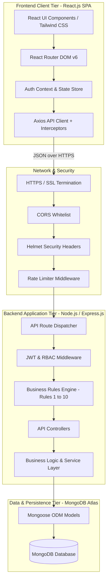

# 12. Technical Architecture & System Design — VPMS

## Document Control
- **Document Version:** 1.0.0
- **Status:** Approved for Discovery / Pre-Development
- **Architecture Pattern:** Decoupled Client-Server Tiered Architecture (MERN)
- **Source Specification:** `React Interview Task V5.0.md`

---

## 1. System Architecture Diagram



---

## 2. Tiered Architectural Breakdown

### 2.1 Frontend Client Tier (React.js)
- **Architecture:** Single Page Application (SPA) bundled with Vite for high-speed builds and hot module replacement.
- **Routing & Route Guards:** `react-router-dom` v6 with custom `<ProtectedRoute roles={['...']}>` wrappers checking authentication status and role clearance before mounting views.
- **State Management:**
  - `AuthContext`: Manages logged-in user credentials, token lifecycle, and login/logout dispatch.
  - Component-level state (`useState`, `useReducer`, `useEffect`) and custom hooks (`useVisitors`, `useDashboardStats`, `useEmployees`).
- **HTTP Client:** `axios` instance configured with base URL, timeout thresholds, and request/response interceptors for token injection and automated 401 redirect handling.
- **Styling Architecture:** Modern responsive styling using Tailwind CSS utility classes and Lucide React icons for a clean, professional aesthetic.

### 2.2 Backend Application Tier (Node.js & Express.js)
- **Architecture:** Modular MVC / Layered Service Architecture with clear separation of responsibilities:
  - **`routes/`:** Defines URL endpoints and attaches specific middleware chains.
  - **`middleware/`:** Authentication verification, RBAC authorization, payload schema validation, error interception.
  - **`controllers/`:** Unpacks request data, orchestrates business logic, and formats JSON responses.
  - **`services/`:** Core business operations, database queries, and business rule enforcement.
  - **`models/`:** Mongoose schemas, field types, compound indexes, and lifecycle hooks.
  - **`utils/`:** Token helpers, date formatting, error classes, and database seed scripts.
- **Business Rules Enforcement Layer:** Centralized validation utility executing atomic verification of Rules 1 through 10 before persisting state changes.

### 2.3 Data Persistence Tier (MongoDB Atlas)
- **Database Engine:** MongoDB 6.0+ hosted on MongoDB Atlas.
- **Data Modeling:** Object Document Mapping (ODM) via Mongoose.
- **Query Optimization:** Compound indexing on `(visitorPhone, visitDate)`, `(visitorPhone, status)`, and `(hostEmployeeId, status)` ensuring high query throughput and sub-50ms execution.

---

## 3. Directory & Folder Structure

```text
jayam-vpms/
├── docs/                           # Complete Product & Technical Specifications
├── server/                         # Backend Application (Node.js + Express)
│   ├── config/                     # Database connection & environment setup
│   ├── controllers/                # Request handlers (auth, visitors, employees, reports)
│   ├── middleware/                 # Auth, RBAC, error handler, rate limiters
│   ├── models/                     # Mongoose schemas (User, Employee, VisitPass, ActivityLog)
│   ├── routes/                     # Express route declarations
│   ├── services/                   # Business rules validation & aggregations
│   ├── utils/                      # Helper functions, logger, seeder script
│   ├── .env.example                # Sample environment variables
│   ├── package.json
│   └── server.js                   # Server bootstrap & entry point
└── client/                         # Frontend Application (React.js + Vite)
    ├── public/                     # Static assets & favicon
    ├── src/
    │   ├── assets/                 # SVGs, images, logos
    │   ├── components/             # Reusable UI components (Navbar, Sidebar, Modals, Tables)
    │   ├── context/                # AuthContext, NotificationContext
    │   ├── hooks/                  # Custom React hooks
    │   ├── layouts/                # DashboardLayout, AuthLayout
    │   ├── pages/                  # Role-specific screens (Admin, Reception, Employee)
    │   ├── services/               # Axios API service definitions
    │   ├── utils/                  # Date helpers, formatters, constants
    │   ├── App.jsx                 # Route definitions & top-level providers
    │   ├── main.jsx                # DOM mounting & root render
    │   └── index.css               # Global CSS & Tailwind imports
    ├── index.html
    ├── tailwind.config.js
    ├── vite.config.js
    └── package.json
```

---

## 4. Hosting & Deployment Topology

| Component | Technology | Recommended Hosting Provider | Free/Hobby Tier Ready |
| :--- | :--- | :--- | :---: |
| **Frontend SPA** | React.js / Vite | Vercel or Netlify | ✅ |
| **Backend API** | Node.js / Express.js | Render, Railway, or Vercel Serverless | ✅ |
| **Database** | MongoDB Atlas | MongoDB Atlas M0 Shared Cluster | ✅ |
| **DNS & SSL** | Let's Encrypt / Cloudflare | Managed by Vercel/Netlify | ✅ |

---

## 5. Logging, Error Handling & Diagnostics

1. **Centralized Error Middleware:** Catch-all Express middleware intercepting all asynchronous exceptions and returning structured JSON payloads:
   ```json
   {
     "success": false,
     "message": "Selected employee has reached maximum pending requests limit (3)",
     "errorCode": "RULE_5_BREACH"
   }
   ```
2. **Activity Audit Trail:** Every business operation writes an immutable entry into the `activity_logs` collection to maintain forensic compliance.
3. **Application Logs:** Structured console logging with timestamps and request methods for debugging during development and production triage.
