# 13. Technology Stack Justification & Trade-Offs — VPMS

## Document Control
- **Document Version:** 1.0.0
- **Status:** Approved for Discovery / Pre-Development
- **Source Specification:** `React Interview Task V5.0.md`

---

## 1. Prescribed Stack vs. Ecosystem Choices

The assessment task explicitly prescribes the **MERN Stack** (MongoDB, Express.js, React.js, Node.js). The following table details the curated ecosystem libraries selected to maximize developer velocity, type safety, security, and UI polish within the 2-day delivery window.

```mermaid
graph LR
    subgraph Frontend [Frontend Layer]
        React[React 18+]
        Vite[Vite Bundler]
        Router[React Router DOM v6]
        Tailwind[Tailwind CSS]
        Lucide[Lucide React Icons]
    end

    subgraph Backend [Backend Layer]
        Node[Node.js LTS]
        Express[Express.js 4.x]
        JWT[jsonwebtoken]
        Bcrypt[bcryptjs]
        Helmet[Helmet & CORS]
    end

    subgraph Database [Persistence Layer]
        Mongo[MongoDB 6.0+]
        Mongoose[Mongoose ODM 8.x]
    end

    Frontend --> Backend
    Backend --> Database
```

---

## 2. Detailed Component Evaluation

### 2.1 Frontend Framework & Build Tool: React.js 18 + Vite
- **Selection:** `React.js` with `Vite`.
- **Why Appropriate:** Mandated by assignment; Vite provides instantaneous Hot Module Replacement (HMR) and sub-second bundle builds compared to legacy Create React App (CRA).
- **Alternatives Considered:** Next.js (overhead of SSR is unnecessary for a role-governed internal management portal), CRA (deprecated and slow).
- **Advantages:** Component reusability, rich ecosystem, vast UI component library compatibility.
- **Disadvantages:** Client-side SPA routing requires fallback configuration on static hosts (e.g. `_redirects` for Netlify/Vercel).
- **MVP Suitability:** 10/10.

### 2.2 Frontend Routing: React Router DOM v6
- **Selection:** `react-router-dom` v6.
- **Why Appropriate:** Industry standard for declarative client-side routing, nested layouts, and route protection wrappers.
- **Advantages:** Clean API for Outlet layouts, programmatic navigation via `useNavigate`, and parameterized routes (`/visitors/:id`).
- **MVP Suitability:** 10/10.

### 2.3 UI Styling & Icons: Tailwind CSS + Lucide React
- **Selection:** Tailwind CSS with Lucide React icons.
- **Why Appropriate:** Allows rapid styling of professional dashboards, badges, and responsive tables without writing thousands of lines of ad-hoc CSS.
- **Alternatives Considered:** Material UI / Ant Design (heavy bundle size and rigid overrides), Vanilla CSS (slower prototyping velocity within 2-day limit).
- **Advantages:** Zero runtime overhead, consistent design tokens, effortless responsive modifiers (`sm:`, `md:`, `lg:`).
- **MVP Suitability:** 10/10.

### 2.4 Backend Runtime & Server: Node.js (LTS) + Express.js 4.x
- **Selection:** `Node.js` + `Express.js`.
- **Why Appropriate:** Mandated by assignment. Lightweight, unopinionated, and battle-tested for REST API services.
- **Alternatives Considered:** NestJS (too much boilerplate for a 2-day MVP), Fastify (less ubiquitous for standard MERN evaluations).
- **Advantages:** Rapid setup, vast middleware ecosystem (CORS, Helmet, Rate Limiters, Morgan).
- **MVP Suitability:** 10/10.

### 2.5 Database & ODM: MongoDB Atlas + Mongoose 8.x
- **Selection:** `MongoDB` hosted on Atlas with `Mongoose` ODM.
- **Why Appropriate:** Mandated by assignment. Document model is ideal for polymorphic records like visitor passes with embedded activity histories and flexible metadata.
- **Alternatives Considered:** PostgreSQL / Prisma (excellent, but task strictly mandates MongoDB).
- **Advantages:** Native JSON format matching Express controllers; Mongoose provides schema validation, pre-save hooks, and population helpers.
- **MVP Suitability:** 10/10.

### 2.6 Security & Authentication: `jsonwebtoken` + `bcryptjs` + `helmet`
- **Selection:** Standard JWT token auth with bcrypt password hashing.
- **Why Appropriate:** Stateless architecture allows seamless deployment on serverless or containerized hosts without session store dependencies (e.g. Redis).
- **Advantages:** Minimal dependencies, robust cryptographic standards.
- **MVP Suitability:** 10/10.

### 2.7 HTTP Client: Axios
- **Selection:** `axios` on the frontend.
- **Why Appropriate:** Built-in support for request/response interceptors, automatic JSON transformation, and clean cancellation/timeout handling.
- **Alternatives Considered:** Fetch API (requires manual error checking and boilerplate header setup).
- **MVP Suitability:** 10/10.

---

## 3. Technology Stack Matrix

| Layer | Technology Selected | Version | Purpose |
| :--- | :--- | :--- | :--- |
| **Frontend Framework** | React.js | `^18.3.0` | Reactive UI view layer |
| **Build Tool** | Vite | `^5.4.0` | Development server and bundler |
| **Routing** | React Router DOM | `^6.26.0` | Client-side routing and RBAC guards |
| **Styling** | Tailwind CSS | `^3.4.0` | Responsive utility styling system |
| **Icons** | Lucide React | `^0.430.0` | Consistent, accessible iconography |
| **HTTP Client** | Axios | `^1.7.0` | REST API communication with interceptors |
| **Date Handling** | date-fns / native Intl | `^3.6.0` | Date formatting and comparisons |
| **Backend Runtime** | Node.js | `20.x LTS` | Server-side JavaScript runtime |
| **API Framework** | Express.js | `^4.19.0` | HTTP web server and REST router |
| **Database ODM** | Mongoose | `^8.5.0` | MongoDB schema modeling and queries |
| **Authentication** | jsonwebtoken | `^9.0.0` | Stateless token signing and verification |
| **Password Security** | bcryptjs | `^2.4.3` | Secure password hashing |
| **Security Headers** | Helmet | `^7.1.0` | HTTP security header configuration |
| **CORS Middleware** | cors | `^2.8.5` | Cross-origin resource sharing policy |
| **Rate Limiting** | express-rate-limit | `^7.4.0` | Brute force defense on auth endpoints |
| **Environment Mgmt** | dotenv | `^16.4.0` | Environment variable isolation |
