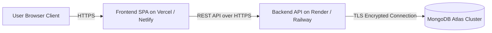

# 17. Production Deployment & Operations Guide — VPMS

## Document Control
- **Document Version:** 1.0.0
- **Status:** Approved for Discovery / Pre-Development
- **Source Specification:** `React Interview Task V5.0.md`

---

## 1. Hosting Topology & Cloud Services



| Component | Target Platform | Free Tier Feasibility | SSL / TLS Provisioning |
| :--- | :--- | :---: | :--- |
| **Frontend SPA** | Vercel or Netlify | ✅ Yes (100% Free) | Automatic Let's Encrypt Wildcard SSL |
| **Backend API** | Render / Railway | ✅ Yes (Free Web Service) | Automatic Cloudflare / Let's Encrypt SSL |
| **Database** | MongoDB Atlas | ✅ Yes (M0 Sandbox 512MB) | TLS 1.3 encrypted cluster connection |

---

## 2. Environment Variables Configuration

### 2.1 Backend Environment Variables (`server/.env`)
```bash
# Server Port & Environment
PORT=5000
NODE_ENV=production

# Database Connection (MongoDB Atlas Connection String)
MONGO_URI=mongodb+srv://<username>:<password>@cluster0.abcde.mongodb.net/jayam_vpms?retryWrites=true&w=majority

# JWT Security Secrets
JWT_SECRET=super_secret_jwt_hmac_sha256_key_replace_in_production_998877
JWT_EXPIRES_IN=8h

# CORS Whitelist (Frontend Domain URL)
CLIENT_URL=https://jayam-vpms.vercel.app

# Rate Limiting Parameters
RATE_LIMIT_WINDOW_MS=900000
RATE_LIMIT_MAX=100
```

### 2.2 Frontend Environment Variables (`client/.env`)
```bash
# Backend API Base URL
VITE_API_URL=https://jayam-vpms-api.onrender.com/api
```

---

## 3. Build & Deployment Execution Steps

### 3.1 Step 1: MongoDB Atlas Setup
1. Create a free shared cluster (M0) on MongoDB Atlas.
2. Under **Network Access**, add IP `0.0.0.0/0` (Allow access from anywhere, required for dynamic cloud hosting like Render).
3. Under **Database Access**, create a user with `readWriteAnyDatabase` permissions.
4. Copy the connection URI string into `MONGO_URI`.

### 3.2 Step 2: Backend API Deployment (Render / Railway)
1. Push codebase to GitHub repository.
2. In Render, select **New Web Service** and connect the repository.
3. Configure settings:
   - **Root Directory:** `server`
   - **Build Command:** `npm install`
   - **Start Command:** `npm start` (or `node server.js`)
4. Under **Environment Variables**, inject all values from `server/.env`.
5. Run the one-time database seeder:
   `node utils/seed.js` or via build step to initialize Admin, Receptionist, and Employee accounts.
6. Note the public service URL (e.g. `https://jayam-vpms-api.onrender.com`).

### 3.3 Step 3: Frontend Deployment (Vercel / Netlify)
1. In Vercel, select **Add New Project** and import the GitHub repository.
2. Configure settings:
   - **Root Directory:** `client`
   - **Framework Preset:** `Vite`
   - **Build Command:** `npm run build`
   - **Output Directory:** `dist`
3. Under **Environment Variables**, add:
   `VITE_API_URL=https://jayam-vpms-api.onrender.com/api`
4. Add SPA routing rewrite rule in `client/vercel.json` or `client/public/_redirects`:
   ```json
   {
     "rewrites": [{ "source": "/(.*)", "destination": "/index.html" }]
   }
   ```
5. Deploy project and verify live availability.

---

## 4. Database Seeding & Initial Credentials

Upon deployment, running `npm run seed` in the `server/` directory populates:
- **Administrator:** `admin@jayam.com` / `Admin@1234`
- **Receptionist:** `reception@jayam.com` / `Reception@1234`
- **Employee 1 (Host):** `david.chen@jayam.com` / `Employee@1234`
- **Employee 2 (Host):** `priya.patel@jayam.com` / `Employee@1234`
- **Employee 3 (Host):** `alex.wong@jayam.com` / `Employee@1234`
- Initial batch of active and pending mock visitor passes for immediate demonstration.

---

## 5. Rollback Strategy & Incident Handling
1. **Frontend Rollback:** Instant 1-click rollback to previous deployment commit in Vercel dashboard.
2. **Backend Rollback:** Render/Railway allows redeploying previous green commit hashes.
3. **Database Integrity:** Atlas automated daily point-in-time snapshots.
